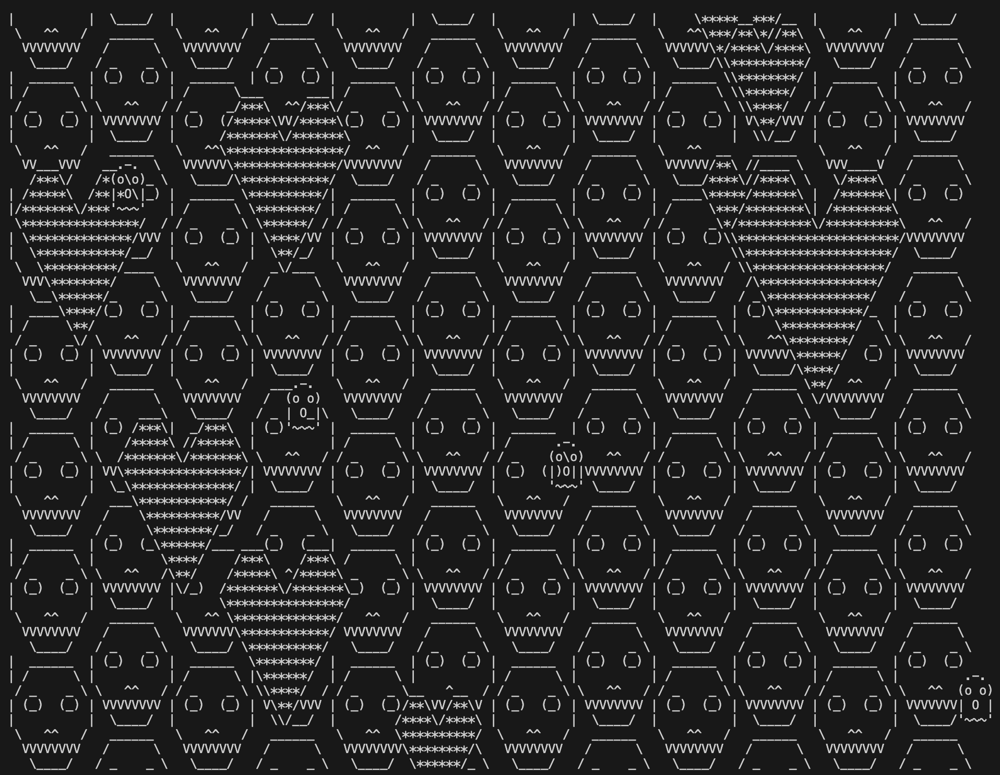

# Creative Coding: Assignment 3 - Scroll Art Museum
For this assignment, I choose to edit the Scrolls and Hearts Art by Al Sweigart. I changed the interior icon of the heart, as well as added a small floating ghost every once in a while.

[Code](skullsheartsghosts.py)

